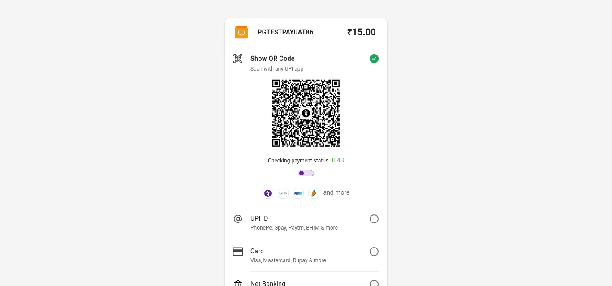
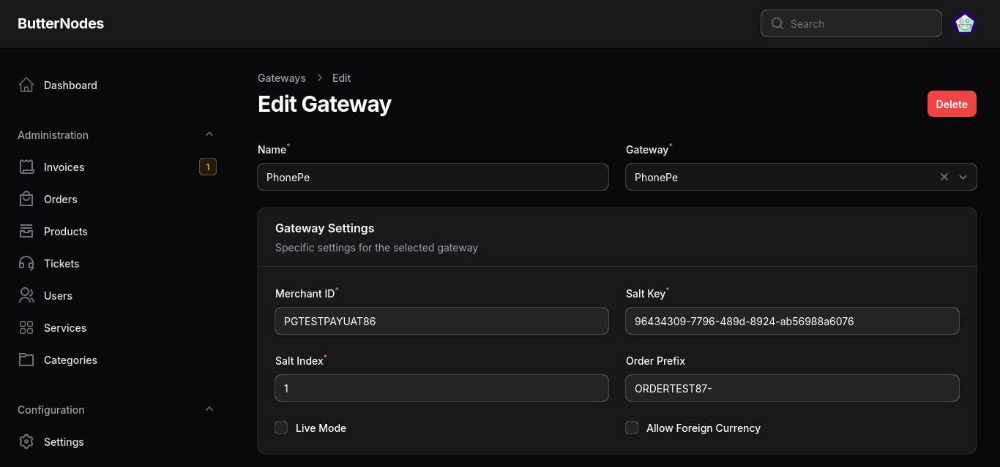

## PhonePe Payment Gateway for Paymenter

A simple extension to integrate PhonePe as a payment gateway within your Paymenter platform, making it easy for customers to pay via PhonePe for a smooth, convenient checkout experience.

## Supported Versions
> The latest version which supported Paymenter v0.9.5 is [v1.0.3](https://github.com/VaibhavSys/PhonePe-Paymenter/tree/v1.0.3)
- **Supported Version:** Paymenter V1 Beta
- **Extension Version:** 2.0.0

## Setup

1. Install the extension
   - Replace `/var/www/paymenter` with your paymenter root if it is different
   - **One-liner Install:** `git clone https://github.com/VaibhavSys/PhonePe-Paymenter.git /var/www/paymenter/extensions/Gateways/PhonePe`
   - **Manual Install:** [Download](https://github.com/VaibhavSys/PhonePe-Paymenter/releases/latest/download/PhonePe.zip) the extension and extract it in `/var/www/paymenter/extensions/Gateways`
2. Enable the extension and setup your PhonePe credentials
3. You are now ready to accept payments using the PhonePe Gateway!
4. Go live when you are done testing!

## Configuration

- **Merchant ID:** PhonePe Merchant ID
- **Salt Key:** PhonePe Salt Key
- **Salt Index:** PhonePe Salt Index
- **Order Prefix (optional):** Prefix of the Order ID. Example: Setting prefix as `ORDER-` will make the Order ID for invoice 8 `ORDER-8`
- **Live (checkbox):** Enable this if you want to use the gateway in production
- **Allow Foreign Currency (checkbox):** Enable this option to allow users to pay invoices in non-INR currencies. The invoice amount will be considered equivalent to the INR amount.

## Security Notice

This extension requires sensitive information, such as your PhonePe Merchant ID and Salt Key. To keep your transactions secure:

- Always store these credentials securely and confidentially.

## Support

For assistance, please reach out to me on [Discord: @vaibhavd](https://discord.com/users/914452175839723550).

## License

- **License:** This is a opensource extension licensed under the [MIT License](LICENSE). The extension is opensource on GitHub: [PhonePe Paymenter GitHub](https://github.com/VaibhavSys/PhonePe-Paymenter)
- **Trademarks:** The PhonePe name and logo are trademarks of PhonePe Pvt Ltd. This project is not affiliated with or endorsed by PhonePe.
